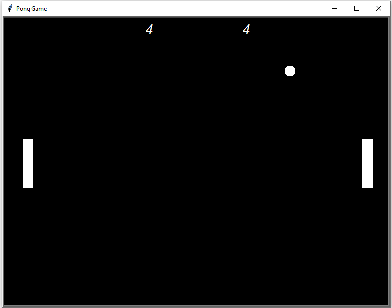

# Pong game using turtle graphics

## The game was part of a python course i was doing. It was a project in the course.

### Game features: 

- Classic Pong game built using Python's Turtle graphics.
- Features two paddles (left and right) with vertical movement.
- Can be played with two players.
- Score display for both players at the top of the screen.
- Ball speed increases after each hit on a paddle.
- Ball speed resets to normal after a point is scored.
- Continuous gameplay without an ending.

### How to run the game: 

- Clone or download this repository to your local machine.
- Make sure you have Python installed.
- Run main.py to start the game.

### How to play the game:

- Control the right paddle with up and down arrow keys.
- Control the left paddle with "W" (up) and "S" (down) keys.
- Hit the ball using your paddle.

